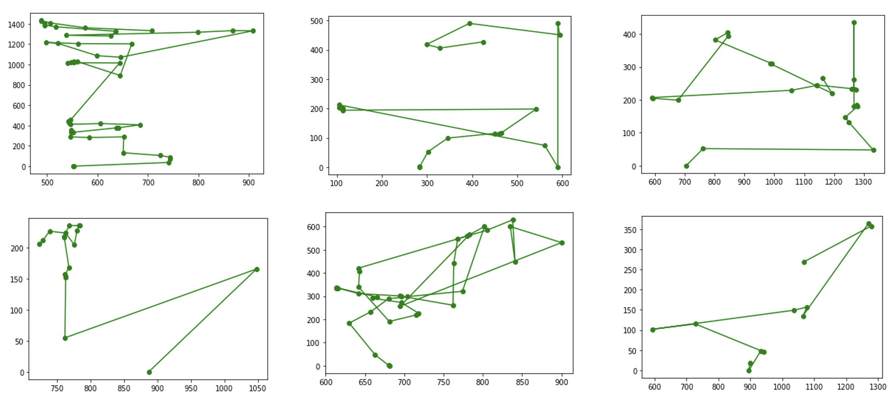
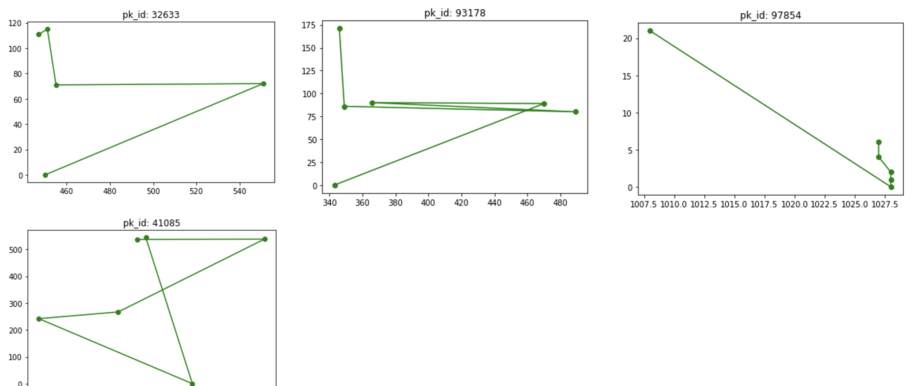
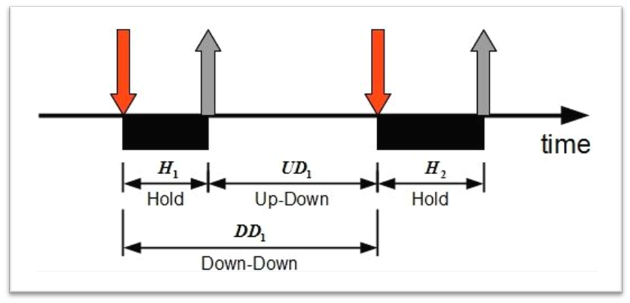

# WebBOT-Behavior

* It is used to detect abnormal operating behavior, such as mouse move and keystroke, that is quite different and high risk compared with human beings on official and mobile banking
* Deployed on login/payment pages by our payment gateway service whose number of merchants was huge, and collected log data about real human activities
* Analysed the risk dataset, generated serveral significant features, and then detected anomaly through ensemble learning(combining SVM, Decision Tree and rule engine) with high accuracy

### Human mouse tracking on website

  

### Web bot moving with same rate and acceleration

  

### Keystroke three features

* **Hold time**: time between press and release of a key
* **Keydown-Keydown time**: time between the pressing of consecutive keys
* **Keyup-Keydown time**: time between the release of one key and the press of next key

  

